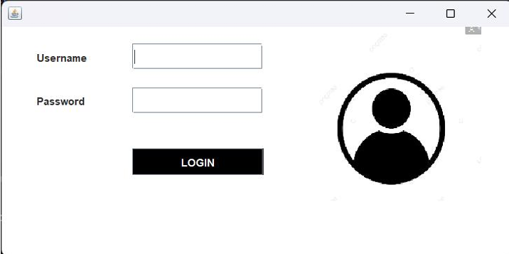
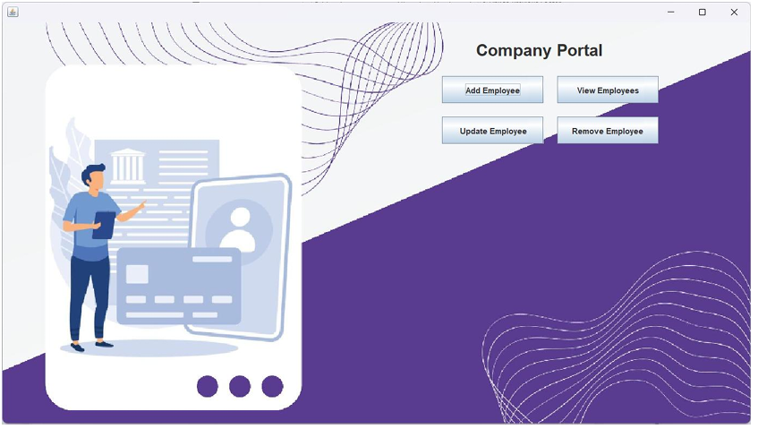
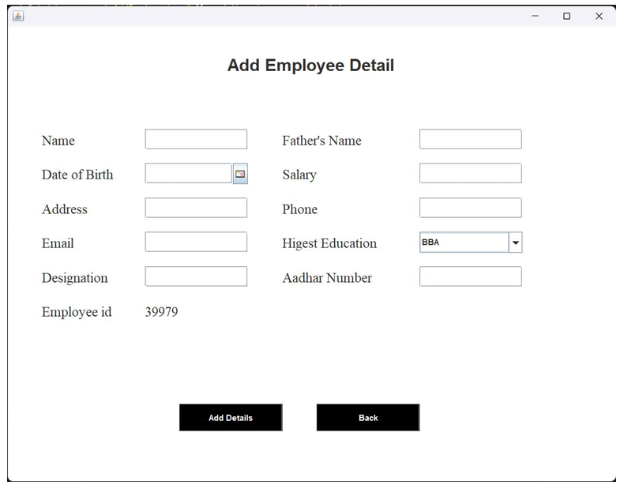
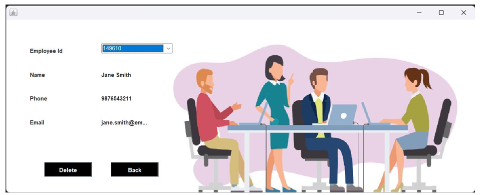
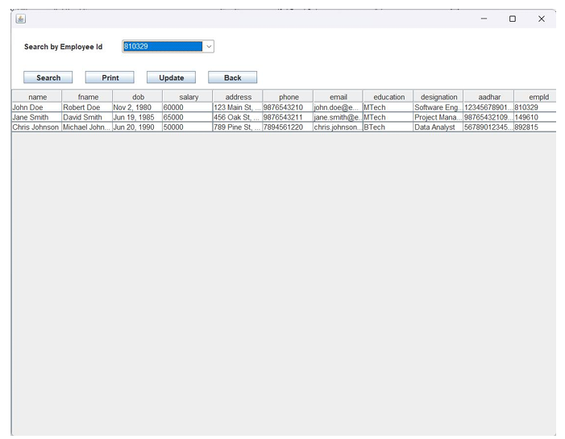

# Employee Management System

## Abstract

Human resource challenges affect businesses of all sizes. Every organization has unique staff management needs, and this system provides customized employee management solutions. The **Employee Management System (EMS)** is designed to help businesses manage human resources effectively, supporting strategic planning and long-term objectives by managing employee data efficiently.

## Introduction

In the era of increasing digitization, managing vast amounts of employee data has become essential. The **EMS** was developed to replace the previous manual system and to simplify the process of managing employee records. With a user-friendly interface, the system eliminates data entry errors and enables administrators to add, view, remove, and update employee records easily.

### Key Features:
- Add, view, update, and remove employee records
- User-friendly interface with error validation for incorrect data
- Simplified employee management for administrators

### Objective:
- Develop an HR management system to facilitate the handling of employee data
- Store employee data in a structured database
- Provide a simple interface for interaction with the system

## Methodology

### Technologies Used:
- **SQL**: For managing employee data in a relational database.
- **Java**: The programming language used to build the application.
- **Swing**: Java GUI toolkit for building the graphical user interface (GUI).

### Steps Taken:
1. Explored concepts of Java Swing and applets.
2. Refined understanding by referring to various sources, including books, journals, and online resources.

## Feasibility Study

### 1. Technical Feasibility
The availability of required hardware and software was ensured, along with the necessary technical expertise to develop the system.

### 2. Operational Feasibility
Evaluating user readiness and management support for the new system to ensure smooth adoption and usage.

### 3. Economic Feasibility
Assessing whether the benefits of automating HR tasks justify the investment in developing the system.

## Implementation and Results

### Key Screens and Features:

1. **Login Frame**  
   The user must enter their credentials to access the system’s main dashboard.  
     *(Login Screen)*

2. **Main Dashboard**  
   After login, the user is directed to the main dashboard where they can perform various operations like adding, deleting, and updating employee data.  
     *(Main Dashboard)*

3. **Add Employee**  
   Admin can add a new employee by entering their credentials.  
     *(Add Employee Screen)*

4. **Remove Employee**  
   Admin can remove an employee by entering their employee ID.  
     *(Remove Employee Screen)*

6. **View and Update Employee**  
   Admin can view or update employee information by entering the employee ID.  
     *(View and Update Employee Screen)*

## Testing

### Test Cases:

| Test ID | Test Purpose                        | Test Condition                                                      | Expected Output                                | Remarks             |
|---------|-------------------------------------|---------------------------------------------------------------------|------------------------------------------------|---------------------|
| TC1     | Check Username & Password           | Incorrect credentials should trigger an error message.              | Access granted to the main dashboard.         | Test successful     |
| TC2     | Add New User                        | If user already exists, show an error message.                       | New user added successfully.                  | Test successful     |
| TC3     | View Existing Employee Information  | If the employee exists, display their information.                  | Employee information displayed.               | Test successful     |
| TC4     | Remove Employee                     | If employee exists, they should be removed.                         | Employee removed successfully.                | Test successful     |
| TC5     | Update Employee Information         | If the employee exists, their information should be updated.        | Employee information updated successfully.    | Test successful     |

## Conclusion

The **Employee Management System** simplifies the management of employee data, making it more secure and efficient for businesses. With this system, administrators can add, remove, and update employee information with ease, leading to better HR operations.

## Future Scope

In the future, we plan to enhance the system with:
- A better graphical interface
- Additional features to improve usability and HR operations further

## Code Example

```java

